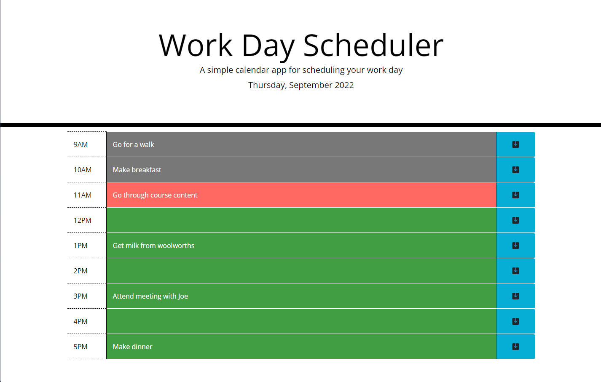

# work-day-scheduler

Simple calendar application that allows a user to save events for each hour of the day. The events are saved to `localstorage` and load automatically when the application is opened.

## Live URL and screenshot

The application can be accessed at the following [url](https://anisha-sapkota.github.io/work-day-scheduler/) and a screenshot is below. Use it to plan your day today!

## Helpful resources

- <https://developer.mozilla.org/en-US/docs/Web/Guide/HTML/Editable_content>
